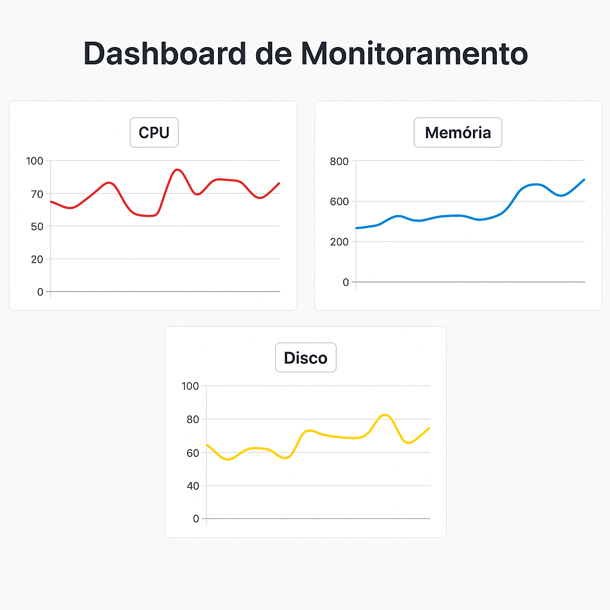

# 📊 Projeto Dashboard de Monitoramento (Frontend)

Este é um projeto de dashboard de monitoramento de recursos, desenvolvido com **HTML**, **CSS** e **JavaScript**, utilizando a biblioteca **Chart.js** para visualização de dados. Os dados são simulados e atualizados a cada 2 segundos, representando o uso de CPU, memória e disco.

---

## 🛠 Tecnologias utilizadas

- HTML5
- CSS3
- JavaScript (ES6+)
- Chart.js

---

## 📌 Funcionalidades

- Visualização gráfica do uso de CPU, Memória e Disco
- Atualização automática dos gráficos a cada 2 segundos
- Interface responsiva e moderna

---

## 💻 Como rodar o projeto

1. Clone o repositório:

```bash
git clone https://github.com/kamilarosaf/dashboard-monitoramento.git
cd dashboard-monitoramento
```
2. Abra o arquivo index.html no navegador (duplo clique ou clique com botão direito > abrir com navegador).

## 📂 Estrutura do projeto
```text
dashboard-monitoramento/
├── index.html
├── style.css
└── script.js
```


## ✨ Melhorias futuras
Adicionar modo escuro

Inserir métricas reais com integração backend

Exportar gráficos como imagem ou PDF

Exibir histórico de dados


## 📸 Screenshot

🔁 


## 👩‍💻 Desenvolvedora

Feito com 💚 por **Kamila Rosa**

- [LinkedIn](https://www.linkedin.com/in/kamila-rosa-15a818309/)
- [Portfólio](https://kamilarosaf.github.io/meu-portfolio/)
